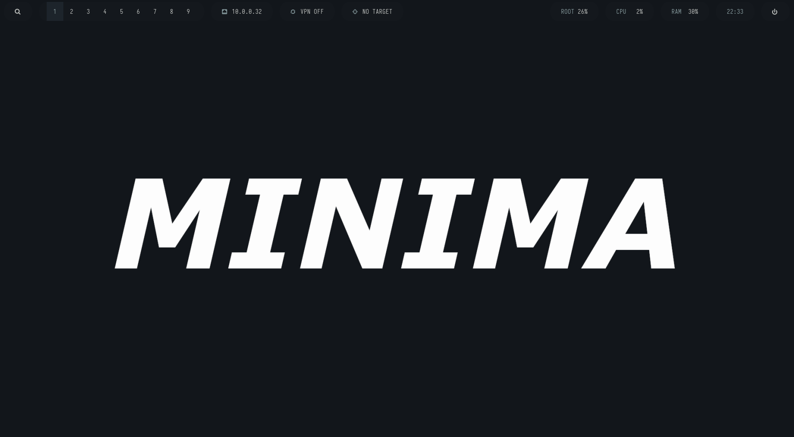

# Minima

A minimalistic pentesting setup.

<div>

<table align=left><tr><td>
<b>- Window Manager: </b><br />
<b>- Bar: </b><br />
<b>- Application Launcher: </b><br />
<b>- Compositor: </b><br />
<b>- Terminal: </b><br />
<b>- Shell: </b><br />
<b>- Editor: </b><br />
<b>- Wallpaper: </b><br />
</table>

<table><tr><td>
<a href="https://github.com/baskerville/bspwm">BSPWM</a><br />
<a href="https://github.com/polybar/polybar">Polybar</a><br />
<a href="https://github.com/davatorium/rofi">Rofi</a><br />
<a href="https://github.com/yshui/picom">Picom</a><br />
<a href="https://alacritty.org/">Alacritty</a><br />
<a href="https://www.zsh.org">Zsh</a><br />
<a href="https://nvchad.com/">Neovim</a><br />
<a href="https://github.com/derf/feh">Feh</a><br />
</table>
</div>

# Table of Contents

- [Documentation](#documentation)
- [Themes](#themes)
- [Gallery](#gallery)
- [Install](#install)

# Documentation

Read the documentation at the [wiki](https://github.com/pwnlog/Minima/wiki) site to learn how to use this configuration.

# Themes

<div align="center">
<b>Colorful Theme / Wallpapers Colors</b>

</a>
</div>

<div align="center">
<b>Light Theme</b>

</a>
</div>

<div align="center">
<b>Dark Theme</b>

</a>
</div>

# Gallery

<div align="center">
<b>Colorful Preview</b>

</a>
</div>
> [!NOTE]
> The **colorful theme** applies the colors of the wallpaper to the system UI

<div align="center">
<b>Animated Wallpapers</b>

</a>

</div>

<div align="center">
<b>Multiple Bars</b>

</a>

</div>

> [!NOTE]
> The **bars** can be moved to the `top` or `bottom` of the screen.

<div align="center">
<b>Bar Themes</b>

> [!NOTE]
> If the **colorful theme** is enabled then the bars will use the colors of the wallpaper.

Light Daku bar:

</a>

Light Dakura bar:

</a>

Light Karafuru bar:

</a>

Light Shisuru bar:

</a>

Dark Daku bar:

</a>

Dark Dakura bar:

</a>

Dark Karafuru bar:

</a>

Dark Shisuru bar:

</a>

</div>

<div align="center">
<b>Change Corners</b>

</a>

</div>

<div align="center">
<b>Change Wallpapers</b>

</a>

</div>

<div align="center">
<b>Wallpapers Selector</b>

</a>

</div>

> [!NOTE]
> Additional information about themes can be found in the [features page](https://github.com/pwnlog/Minima/wiki/Features) of the wiki site. Information about wallpapers can be found at the installation page in the [wallpapers section](https://github.com/pwnlog/Minima/wiki/Installation#Wallpapers).

# Install

Install the configuration in your host:

```sh
./install.sh
```

> [!NOTE]
> Do NOT run this script with root or sudo; please read the [wiki installation page](https://github.com/pwnlog/Minima/wiki/Installation) for more information.

## Neovim 

Install the language servers:

```sh
MasonInstallAll
```

Install treesitter parser for syntax highlighting:

```sh
TSInstall all
```

> [!WARNING]
> This can be slow and may crash neovim.

Install treesitter parser for some languages:

```sh
TSInstall elixir bash python rust go lua perl
```